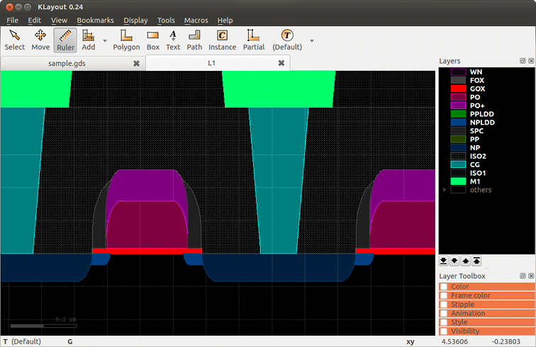

# KLayout PYXS Project Home Page

[klayout_pyxs](https://github.com/klayoutmatthias/xsection) is a package that
implements a cross-section generator for the KLayout VLSI
layout viewer and editor [http://www.klayout.de](http://www.klayout.de).

It is a port of Ruby script [xsection](https://github.com/klayoutmatthias/xsection).
Most of the algorithms / tests / documentation are taken with minor adaptations
from XSection project.

## Installation

Installations instructions to be defined.

In order to use the cross section generator, a description of the process must be provided.
Such a description is stored in files with extension ".pyxs". They contain a step-by-step
receipe how the layer stack is formed. Statements will describe individual process steps
such as etching, deposition and material conversion (i.e. implant).

The source tree contains one example for such a file in "samples/cmos.pyxs". This example
illustrates how to create a ".pyxs" and has a lot of documentation inside. Have a look at
this file here: [cmos.pyxs](cmos.pyxs).

## Using The KLayout PYXS Module

Start KLayout after you have installed the script. You will find a new entry in the "Tools" menu.
Choosing "Tools/pyxs/Load pyxs script" opens a file browser and you are prompted for the .pyxs file.

To create a cross section, draw a ruler into the layout indicating the line along which the
cross section is created. Choose "Tools/pyxs/Load pyxs script" to select
the ".pyxs" file and to generate the cross section in a new layout window. Once you have
used a ".pyxs" file, it is available in the recently used files list below the "Tools/pyxs"
menu entry for quick access.

An introduction into writing PYXS files can be found here: [Writing PYXS Files - an Introduction](DocIntro).

A function reference is also available here: [PYXS File Reference](DocReference).

## Example

The following screenshot shows a sample cross section taken from the
[cmos.pyxs](cmos.pyxs) sample file and the [sample.gds](sample.gds) layout found in the samples folder:

